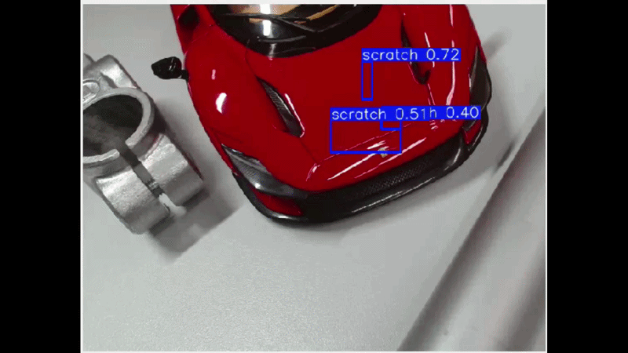

# Synthetic-Surface-Defects

Official implementation of the paper **"ScratchSim: A Procedural Synthetic Data Pipeline for Surface Scratch Detection"** ([arXiv:2607.27065](https://arxiv.org/abs/2607.27065)).

## Abstract

While automated defect detection such as the detection of surface scratches is an important aspect in industrial quality control, the scarcity of annotated defect data makes this task challenging. This paper presents a procedural rendering pipeline that generates large-scale annotated synthetic training data using BlenderProc, with configurable material appearance, camera modes, and domain randomization, producing automatic COCO-format annotations. To show the potential of our approach, we evaluate four training strategies, namely synthetic-only, real-only, mixed, and fine-tuning from synthetic weights, across two objects with different material properties and three lightweight edge-deployable detectors, YOLOX, YOLO26, and LW-DETR. Our evaluation shows that fine-tuning from synthetic weights consistently outperforms real-only training, and that mixed training effectively recovers performance under scarce real-data conditions, with findings validated across both convolutional and transformer-based architectures. The proposed approach enables scalable defect detection without the burden of large real annotated datasets, making it practical for on-device industrial inspection.

## Installation

### 1. Install BlenderProc
```bash
pip install blenderproc
```

### 2. Install pycairo
#### 2.1 Install dependencies
```bash
sudo apt update
sudo apt install libcairo2-dev pkg-config
```

#### 2.2 Install Python 3.11 (Debian/Ubuntu)
Pycairo requires python 3.11 in order to work with BlenderProc 2.8.0 / Blender 4.2.1 LTS.

Add the deadsnakes PPA and install Python 3.11 dev and venv packages:
```bash
sudo add-apt-repository ppa:deadsnakes/ppa
sudo apt update
sudo apt install python3.11-venv python3.11-dev
```

#### 2.3 Install pycairo into BlenderProc
Use BlenderProc's pip wrapper:
```bash
blenderproc pip install pycairo
```
### 3. Download CC_Textures
```bash
blenderproc download cc_textures <output_dir>
```

### 4. (Optional) Install debugpy for IDE debug support
```bash
blenderproc pip install debugpy
```

## Quickstart

- BlenderProc needs to be installed on your machine (currently running version 2.8.0)
- You need cctextures from ambientcg. BlenderProc provides a script to download the full library.

To run/debug the script cd into its directory and execute "blenderproc run/debug createScene_tripod.py" with the following arguments:

- --blend_file \<path to .blend file\> (example: .\Objects\daytona.blend)
- --cc_material_path \<path to cctextures directory\> (example: E:\DataGeneration\BlenderProc\resources\cctextures)
- --resolution \<wanted resolution for the pictures\> (default: 640 640)
- --runs \<number of picture sets\> (default: 1) 
- --frames \<number of pictures per set\> (default: 1) 
- --random_texture Randomize applied material in color and roughness
- --random_background Apply random cctexture to planes (default: white background)
- --setup Setup of the camera. Options: Tripod and random (default: tripod)
- --length Length of the real model. 0.3 = 30 cm

Example:
```bash
blenderproc run createScene.py --blend_file Objects/daytona.blend --cc_material_path <cc_textures dir> --length 0.3 
```

To visualize and save a copy of the coco-annotations execute:
```bash
blenderproc vis coco -i \<picture number\> -b output -s
```

## Dataset

[](https://huggingface.co/datasets/saptarshineilsinha/ToyFerrariCarScratchDefectDataset)

Both the **real datasets (toy car Ferrari)** and the **synthetic datasets generated by our pipeline (toy car Ferrari)** are publicly available on Hugging Face:

🤗 **[saptarshineilsinha/ToyFerrariCarScratchDefectDataset](https://huggingface.co/datasets/saptarshineilsinha/ToyFerrariCarScratchDefectDataset)**

Download via the `datasets` library:

```python
from datasets import load_dataset

dataset = load_dataset("saptarshineilsinha/ToyFerrariCarScratchDefectDataset")
```

Or clone the repository directly:

```bash
git lfs install
git clone https://huggingface.co/datasets/saptarshineilsinha/ToyFerrariCarScratchDefectDataset
```

## Demo

Demo of using **YOLO26**

<details>
<summary>Preview as GIF / local file</summary>



Full resolution: [`video/daytona_clips_full_30_sec_detector_yolo26_demo.mp4`](video/daytona_clips_full_30_sec_detector_yolo26_demo.mp4)

</details>

## Authors and acknowledgment

### Main collaborators

- Saptarshi Neil Sinha — Project administration and conceptualization
- Tiago Kleist
- Richard Hoffmann
- Julius Kühn


### Third-party assets

The blender model being used is a combination of the two following projects:
- "2022 Ferrari Daytona SP3" (https://skfb.ly/pqXFP) by Ddiaz Design is licensed under Creative Commons Attribution (http://creativecommons.org/licenses/by/4.0/).

- "Ferrari Daytona SP3 2022 | www.vecarz.com" (https://skfb.ly/p8K7s) by vecarz is licensed under Creative Commons Attribution (http://creativecommons.org/licenses/by/4.0/).

## License
This project is licensed under the **MIT License**.

```text
MIT License

Copyright (c) 2026

Permission is hereby granted, free of charge, to any person obtaining a copy
of this software and associated documentation files (the "Software"), to deal
in the Software without restriction, including without limitation the rights
to use, copy, modify, merge, publish, distribute, sublicense, and/or sell
copies of the Software, and to permit persons to do so, subject to the
following conditions:

The above copyright notice and this permission notice shall be included in all
copies or substantial portions of the Software.

THE SOFTWARE IS PROVIDED "AS IS", WITHOUT WARRANTY OF ANY KIND, EXPRESS OR
IMPLIED, INCLUDING BUT NOT LIMITED TO THE WARRANTIES OF MERCHANTABILITY,
FITNESS FOR A PARTICULAR PURPOSE AND NONINFRINGEMENT. IN NO EVENT SHALL THE
AUTHORS OR COPYRIGHT HOLDERS BE LIABLE FOR ANY CLAIM, DAMAGES OR OTHER
LIABILITY, WHETHER IN AN ACTION OF CONTRACT, TORT OR OTHERWISE, ARISING FROM,
OUT OF OR IN CONNECTION WITH THE SOFTWARE OR THE USE OR OTHER DEALINGS IN THE
SOFTWARE.

```

```
The code is under MIT license but objects used in this project are licensed under the Creative Commons
Attribution 4.0 International License (CC BY 4.0). Please provide appropriate attribution when using these objects.
```

## Citation

If you use this repository or our pipeline in your research, please cite our paper:

~~~bibtex
@misc{kühn2026scratchsimproceduralsyntheticdata,
      title={ScratchSim: A Procedural Synthetic Data Pipeline for Surface Scratch Detection}, 
      author={Paul Julius Kühn and Saptarshi Neil Sinha and Tiago Kleist and Richard Hoffmann and Arjan Kuijper and Michael Weinmann},
      year={2026},
      eprint={2607.27065},
      archivePrefix={arXiv},
      primaryClass={cs.CV},
      url={https://arxiv.org/abs/2607.27065}, 
}
~~~


